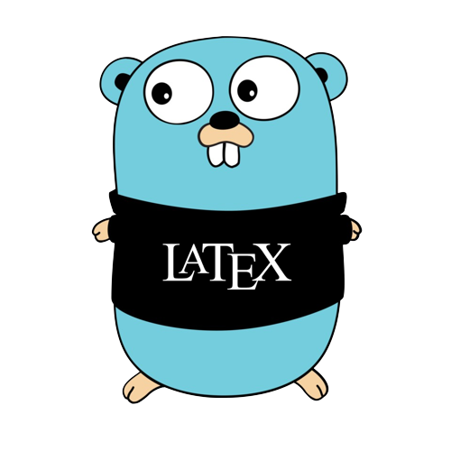

# $\LaTeX$ to Image Bot

Telegram bot built using Go programming language that allows users to convert LaTeX code into images.


<!-- PROJECT LOGO -->
<div align="center">
    
</div>


### Built With

 

* [go-telegram-bot-api](https://github.com/go-telegram-bot-api/telegram-bot-api)
* [MiKTeX ](https://miktex.org/)
* [ImageMagick](https://imagemagick.org/index.php)


 
 
## Demo


https://user-images.githubusercontent.com/92264237/237025713-1adc9b5a-c717-46a6-b93d-f33d23e1dae7.mp4


### Installation

To test locally 

1. Clone the repo
```sh
git clone 
```

2. Install dependencies

```sh
go get -u github.com/go-telegram-bot-api/telegram-bot-api
```

3. Install MiKTeX and ImageMagick

4. Create a bot using [BotFather](https://t.me/botfather) and get the token, store in in the environment variable `GO_TELEGRAM_APITOKEN`

5. Run the bot

```sh
go run main.go
```

